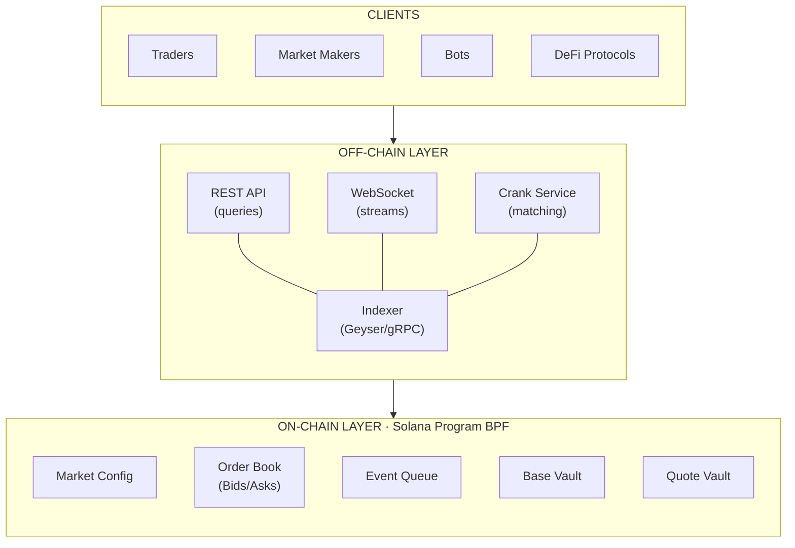

# Matchbook

[](./LICENSE)
[](https://crates.io/crates/matchbook)
[](https://crates.io/crates/matchbook)
[](https://github.com/joaquinbejar/matchbook/stargazers)
[](https://github.com/joaquinbejar/matchbook/issues)
[](https://github.com/joaquinbejar/matchbook/pulls)

[](https://github.com/joaquinbejar/matchbook/actions)
[](https://codecov.io/gh/joaquinbejar/matchbook)
[](https://libraries.io/github/joaquinbejar/matchbook)
[](https://docs.rs/matchbook)

**High-performance, non-custodial Central Limit Order Book (CLOB) on Solana.**

---

## Overview

Matchbook is a fully on-chain order book implementation for Solana, designed for public, permissionless, and non-custodial trading. The architecture prioritizes:

- **Deterministic on-chain execution** — All state transitions are reproducible and verifiable
- **High performance within real compute limits** — Optimized for Solana's constraints
- **Clear separation of concerns** — Critical logic on-chain, infrastructure off-chain
- **Professional infrastructure compatibility** — Built for indexers, market makers, and bots

This is not a toy project. It's a technical reference for building institutional-grade trading infrastructure on a public blockchain.

## Architecture



## Key Features

### On-Chain Program

- **Price-time priority matching** — Standard CLOB semantics (FIFO)
- **Multiple order types** — Limit, Market, IOC, Post-Only, Fill-or-Kill
- **Non-custodial escrow** — Funds controlled by program PDAs
- **Permissionless cranking** — Anyone can trigger order matching
- **Event-driven architecture** — Efficient off-chain indexing via event queue

### Off-Chain Services

- **Real-time indexer** — Geyser-based account subscription
- **REST & WebSocket APIs** — Full market data and trading interface
- **Crank service** — Automated order matching with priority fee management

### Client SDKs

- **Rust SDK** — Native, type-safe client library
- **TypeScript SDK** — For web and Node.js applications

## Project Structure

```
matchbook/
├── program/           # Solana on-chain program
│   ├── src/
│   │   ├── state/     # Account structures
│   │   ├── instructions/
│   │   └── error.rs
│   └── Cargo.toml
├── indexer/           # Off-chain indexer service
├── api/               # REST + WebSocket server
├── crank/             # Crank service
├── sdk/               # Rust client SDK
├── ts-sdk/            # TypeScript SDK
└── .internalDoc/      # Design documentation
```

## Installation

### Prerequisites

```bash
# Rust
curl --proto '=https' --tlsv1.2 -sSf https://sh.rustup.rs | sh

# Solana CLI
sh -c "$(curl -sSfL https://release.solana.com/v1.18.0/install)"

# Anchor (optional)
cargo install --git https://github.com/coral-xyz/anchor avm --locked
avm install latest
```

### Build

```bash
# Clone repository
git clone https://github.com/joaquinbejar/matchbook.git
cd matchbook

# Build on-chain program
cd program && cargo build-sbf

# Build off-chain services
cargo build --release
```

### Deploy (Devnet)

```bash
# Configure for devnet
solana config set --url devnet

# Deploy program
solana program deploy target/deploy/matchbook.so

# Initialize a market
matchbook-cli create-market \
  --base-mint So11111111111111111111111111111111111111112 \
  --quote-mint EPjFWdd5AufqSSqeM2qN1xzybapC8G4wEGGkZwyTDt1v \
  --tick-size 100 \
  --lot-size 1000000
```

## Usage

### Rust SDK

```rust
use matchbook_sdk::{OrderBookClient, TradingClient, Side, OrderType};
use solana_sdk::signature::Keypair;

#[tokio::main]
async fn main() -> Result<(), Box<dyn std::error::Error>> {
    // Connect to API
    let client = OrderBookClient::new("https://api.matchbook.example");

    // Get order book
    let book = client.get_orderbook(&market_address, Some(10)).await?;
    println!("Best bid: {:?}, Best ask: {:?}", book.best_bid(), book.best_ask());

    // Place an order
    let trading = TradingClient::new(&connection, program_id);
    let (signature, order_id) = trading.place_order(
        &market,
        &keypair,
        PlaceOrderParams {
            side: Side::Bid,
            price: 10500,  // In ticks
            quantity: 100, // In lots
            order_type: OrderType::Limit,
            client_order_id: 1,
            ..Default::default()
        },
    ).await?;

    println!("Order placed: {}", order_id);
    Ok(())
}
```

### TypeScript SDK

```typescript
import { OrderBookClient, TradingClient, Side, OrderType } from '@matchbook/sdk';
import { Keypair, Connection } from '@solana/web3.js';

const client = new OrderBookClient('https://api.matchbook.example');

// Get order book
const book = await client.getOrderBook(marketAddress, 10);
console.log(`Spread: ${book.bestAsk - book.bestBid}`);

// Subscribe to updates
client.subscribeOrderBook(marketAddress, 20, (update) => {
  console.log('Book update:', update);
});

// Place order
const trading = new TradingClient(connection, programId);
const { signature, orderId } = await trading.placeOrder(market, keypair, {
  side: Side.Bid,
  price: 105.00,
  quantity: 1.0,
  orderType: OrderType.Limit,
});
```

### WebSocket API

```javascript
const ws = new WebSocket('wss://ws.matchbook.example/v1/stream');

ws.onopen = () => {
  // Subscribe to order book
  ws.send(JSON.stringify({
    type: 'subscribe',
    channel: 'book',
    market: 'MARKET_ADDRESS',
    depth: 20
  }));
};

ws.onmessage = (event) => {
  const data = JSON.parse(event.data);
  if (data.type === 'book_update') {
    console.log('Book delta:', data.changes);
  }
};
```

## Documentation

Detailed design documentation is available in `.internalDoc/`:

| Document | Description |
|----------|-------------|
| [Architecture Overview](.internalDoc/01-architecture-overview.md) | System design, components, data flow |
| [Domain Model](.internalDoc/02-domain-model.md) | Core types, invariants, matching algorithm |
| [On-Chain Design](.internalDoc/03-onchain-design.md) | Solana accounts, PDAs, instructions |
| [Off-Chain Services](.internalDoc/04-offchain-services.md) | Indexer, API, crank service |
| [Protocols](.internalDoc/05-protocols.md) | REST & WebSocket API specifications |
| [Client SDK](.internalDoc/06-client-sdk.md) | SDK design and usage |
| [Deployment](.internalDoc/07-deployment.md) | Docker, Kubernetes, CI/CD |
| [Operations](.internalDoc/08-operations.md) | Monitoring, alerting, runbooks |
| [Rust Guidelines](.internalDoc/09-rust-guidelines.md) | Coding standards and best practices |

## Design Principles

1. **On-chain minimalism** — Only trust-critical logic lives on-chain
2. **Permissionless matching** — No central operator; anyone can crank
3. **Deterministic execution** — Every state transition is reproducible
4. **Fail-safe defaults** — Reject transactions when in doubt
5. **Observable state** — All market data is public and verifiable

## Use Cases

- **DEXs** — Spot or derivatives exchanges with order book matching
- **Tokenized commodities** — Markets requiring discrete pricing
- **RWA trading** — Real-world assets with institutional requirements
- **Hybrid CeFi/DeFi** — Bridge between traditional and decentralized finance
- **Backtesting** — Simulation with realistic on-chain constraints

## Roadmap

- [x] Design documentation
- [ ] On-chain program (Milestone 1)
- [ ] Off-chain services (Milestone 2)
- [ ] Client SDKs (Milestone 3)
- [ ] Production deployment (Milestone 4)

See [GitHub Issues](https://github.com/joaquinbejar/matchbook/issues) for detailed progress.

## Performance

| Metric | Target |
|--------|--------|
| Order placement | < 50,000 CU |
| Match execution | < 100,000 CU per match |
| Indexer latency | < 500ms from slot |
| API p99 latency | < 100ms |
| WebSocket updates | < 50ms from on-chain |

## Security

- Non-custodial design — Program PDAs control all funds
- No trusted relayers — Permissionless operation
- Checked arithmetic — All operations use overflow protection
- Comprehensive testing — Unit, integration, and property-based tests

For security concerns, please email security@taunais.com.

## Contribution and Contact

We welcome contributions to this project! If you would like to contribute, please follow these steps:

1. Fork the repository.
2. Create a new branch for your feature or bug fix.
3. Make your changes and ensure that the project still builds and all tests pass.
4. Commit your changes and push your branch to your forked repository.
5. Submit a pull request to the main repository.

If you have any questions, issues, or would like to provide feedback, please feel free to contact the project maintainer:

### Contact Information

- **Author**: Joaquín Béjar García
- **Email**: jb@taunais.com
- **Telegram**: [@joaquin_bejar](https://t.me/joaquin_bejar)
- **Repository**: https://github.com/joaquinbejar/matchbook
- **Documentation**: https://docs.rs/matchbook

We appreciate your interest and look forward to your contributions!

## License

This project is licensed under MIT. See [LICENSE-MIT](./LICENSE-MIT) for details.
